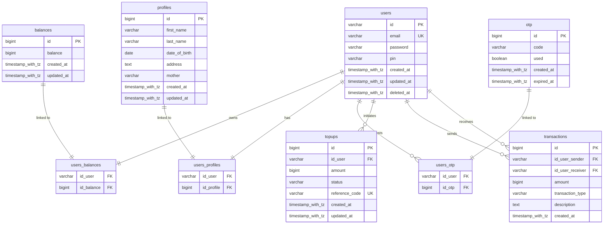

# APPLICATION CLI

## ERD

```mermaid

erDiagram

    users {
        varchar id PK
        varchar email UK
        varchar password
        varchar pin
        timestamp_with_tz created_at
        timestamp_with_tz updated_at
        timestamp_with_tz deleted_at
    }

    balances {
        bigint id PK
        bigint balance
        timestamp_with_tz created_at
        timestamp_with_tz updated_at
    }

    users_balances {
        varchar id_user FK
        bigint id_balance FK
    }

    profiles {
        bigint id PK
        varchar first_name
        varchar last_name
        date date_of_birth
        text address
        varchar mother
        timestamp_with_tz created_at
        timestamp_with_tz updated_at
    }

    users_profiles {
        varchar id_user FK
        bigint id_profile FK
    }

    otp {
        bigint id PK
        varchar code
        boolean used
        timestamp_with_tz created_at
        timestamp_with_tz expired_at
    }

    users_otp {
        varchar id_user FK
        bigint id_otp FK
    }

    topups {
        bigint id PK
        varchar id_user FK
        bigint amount
        varchar status
        varchar reference_code UK
        timestamp_with_tz created_at
        timestamp_with_tz updated_at
    }

    transactions {
        bigint id PK
        varchar id_user_sender FK
        varchar id_user_receiver FK
        bigint amount
        varchar transaction_type
        text description
        timestamp_with_tz created_at
    }

    users ||--|| users_balances : "owns"
    balances ||--|| users_balances : "linked to"

    users ||--|| users_profiles : "has"
    profiles ||--|| users_profiles : "linked to"

    users ||--o{ users_otp : "requests"
    otp ||--|| users_otp : "linked to"

    users ||--o{ topups : "initiates"
    
    users ||--o{ transactions : "sends"
    users ||--o{ transactions : "receives"

```