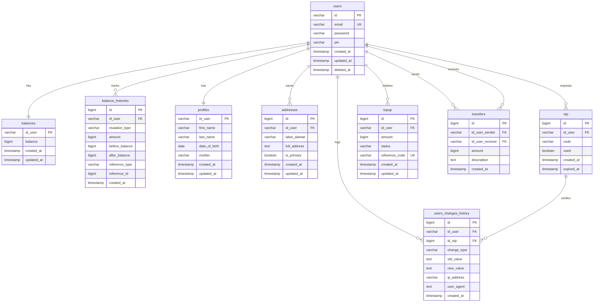

# APPLICATION CLI

## ERD

```mermaid

erDiagram

users {
    varchar id PK
    varchar email UK
    varchar password
    varchar pin
    timestamp created_at
    timestamp updated_at
    timestamp deleted_at
}

balances {
    varchar id_user PK
    bigint balance
    timestamp created_at
    timestamp updated_at
}

balance_histories {
    bigint id PK
    varchar id_user FK
    varchar mutation_type
    bigint amount
    bigint before_balance
    bigint after_balance
    varchar reference_type
    bigint reference_id
    timestamp created_at
}

profiles {
    varchar id_user PK
    varchar first_name
    varchar last_name
    date date_of_birth
    varchar mother
    timestamp created_at
    timestamp updated_at
}

addresses {
    bigint id PK
    varchar id_user FK
    varchar label_alamat
    text full_address
    boolean is_primary
    timestamp created_at
    timestamp updated_at
}

otp {
    bigint id PK
    varchar id_user FK
    varchar code
    boolean used
    timestamp created_at
    timestamp expired_at
}

users_changes_history {
    bigint id PK
    varchar id_user FK
    bigint id_otp FK
    varchar change_type
    text old_value
    text new_value
    varchar ip_address
    text user_agent
    timestamp created_at
}

topup {
    bigint id PK
    varchar id_user FK
    bigint amount
    varchar status
    varchar reference_code UK
    timestamp created_at
    timestamp updated_at
}

transfers {
    bigint id PK
    varchar id_user_sender FK
    varchar id_user_receiver FK
    bigint amount
    text description
    timestamp created_at
}

users ||--|| balances : has
users ||--o{ balance_histories : tracks
users ||--|| profiles : has
users ||--o{ addresses : saves
users ||--o{ otp : requests
users ||--o{ users_changes_history : logs
otp ||--o{ users_changes_history : verifies
users ||--o{ topup : initiates
users ||--o{ transfers : sends
users ||--o{ transfers : receives

```